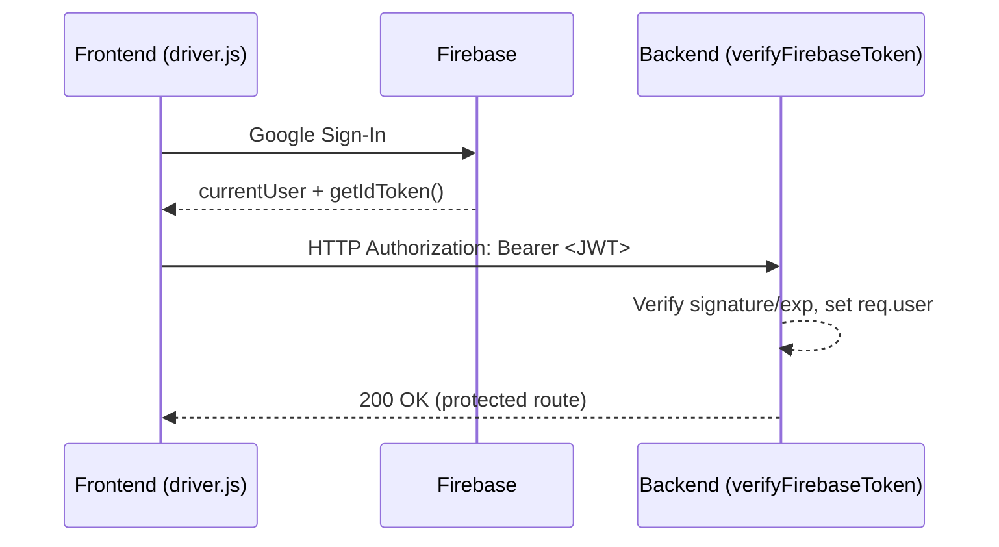
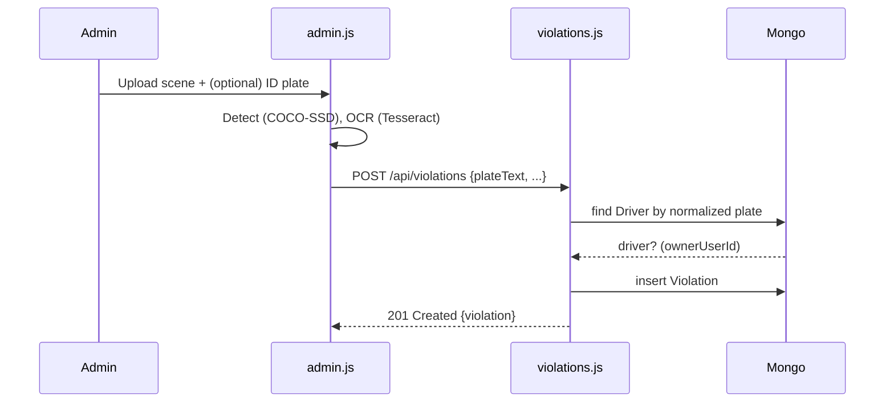

# System Logic: End-to-End, Deep Dive

This document explains every flow in detail: who initiates it, which files and functions are involved, what requests are made, how data is transformed, and what is stored in MongoDB. Includes rationale, edge cases, and sequence diagrams.

## 1) Authentication (Google Sign-In + JWT)
- **Frontend init**: `frontend/firebase.js` sets up Firebase; pages import it (`frontend/landing.js`, `frontend/admin.js`, `frontend/driver.js`).
- **Sign-in**: `window.firebaseAuth.signInWithGoogle()` triggers Google SSO. After success, `firebase.auth().currentUser` is populated.
- **JWT acquisition**: Frontend calls `getIdToken()` and sends `Authorization: Bearer <token>` for protected requests.
- **Verification**: `backend/src/utils/auth.js` → `verifyFirebaseToken` is applied to `/api/violations`, `/api/drivers`, `/api/payments` in `backend/server.js`.
- **Why JWT?** Stateless, verifiable (Google public keys), self-contained claims (`uid`, `exp`), simpler than server sessions.
- **Edge cases**: Expired/missing token → 401. Account switch → new `uid`.

## 2) Admin Flow: Upload → Detect → OCR → Save
- **Files**: `frontend/admin.html`, `frontend/admin.js`
- **Key symbols**: `handleViolationFile()`, `handleIdPlateFile()`, `ensureCoco()`, `estimateRiderCount()`, `detectHelmet()`, `runOCR()`, `idPlateOverride`.

### 2.1 Upload & Canvas
- Scene image → `#canvas` for ML/OCR; preview to `#violationPreview`.
- ID plate tile → `#idPlateCanvas` (optional, more accurate OCR).
- On each new scene upload: reset `idPlateOverride = null` to avoid stale plates.

### 2.2 Detection (TensorFlow.js COCO-SSD)
- Load once: `cocoSsd.load({ base: 'lite_mobilenet_v2' })`.
- `cocoModel.detect(canvas)` → filter `person|motorcycle` with score > 0.5.
- `estimateRiderCount()` constrains persons near the motorcycle bbox.
- `detectHelmet()` samples head-region pixels to infer helmet.

### 2.3 OCR (Tesseract.js)
- Scene OCR: `runOCR(canvas)` with whitelist.
- ID OCR: `recognize(idPlateCanvas)`; sets `idPlateOverride`.
- `plateClean = toUpperCase().replace(/[^A-Z0-9]/g,'')` for matching only.
- Final: `finalPlate = (idPlateOverride && idPlateOverride.length>=4) ? idPlateOverride : plateClean`.

### 2.4 Save Violation
- Frontend `POST /api/violations` with `{ imageUrl, plateText: finalPlate, riderCount, helmetDetected, violationTypes, metadata }`.
- Backend (`backend/src/routes/violations.js`):
  - `computeAmount()` adds 500 for `NO_HELMET`, 1000 for `OVER_CAPACITY`, min 300.
  - Persist exact `plateText` + `normalizedPlateText`.
  - Owner match via `Driver.plateNumberNormalized`.

## 3) Driver Profile: Register, View, Edit
- Register (`POST /api/drivers/register`): exact `plateNumber` stored; pre-validate fills `plateNumberNormalized` (unique index).
- View (`GET /api/drivers/profile`): shows `#profileCard` and `#btnEditProfile`.
- Edit (`PATCH /api/drivers/profile`): toggles form, prefilled, normalized uniqueness enforced; card refreshes via `loadProfile()`.

## 4) Driver Home: List & Pay
- List (`GET /api/drivers/violations?status=pending|paid`): `{ ownerUserId: uid } OR { plateText: driver.plateNumber }` + status.
- Pay:
  1. `POST /api/payments/create-order` → `{ orderId, keyId, amount, currency }`.
  2. Open Razorpay Checkout with `order_id`.
  3. On success: handler receives `{ razorpay_order_id, razorpay_payment_id, razorpay_signature }`.
  4. `POST /api/payments/verify` with these + `violationId`.
  5. Server HMAC check → set `paymentStatus='paid'`, `paidAt=now`.
  6. `refreshHome()` moves item from Pending to Paid.

## 5) Persistence & Indexes (MongoDB)
- Connection: `backend/server.js` using env `MONGODB_URI`, `MONGODB_DB`.
- Collections: `drivers` (unique on `plateNumberNormalized`), `violations` (index `normalizedPlateText`).
- Timestamps: `{ timestamps: true }` → `createdAt`, `updatedAt`.

## 6) Amount/Fine Logic
- `computeAmount()` in `backend/src/routes/violations.js`:
  - `NO_HELMET` → +500
  - `OVER_CAPACITY` → +1000
  - Minimum/base fine fallback → 300

## 7) Security & Secrets
- Protected routes: all `/api/*` behind `verifyFirebaseToken`.
- Secrets: only `RAZORPAY_KEY_ID` goes to client; `RAZORPAY_KEY_SECRET`, Mongo creds, Firebase Admin key remain server-side.
- Input checks: normalize only for matching; keep exact strings for display.

## 8) Extensibility
- Swap in ANPR/helmet models, store images in object storage, add webhooks/notifications, build analytics dashboards.
